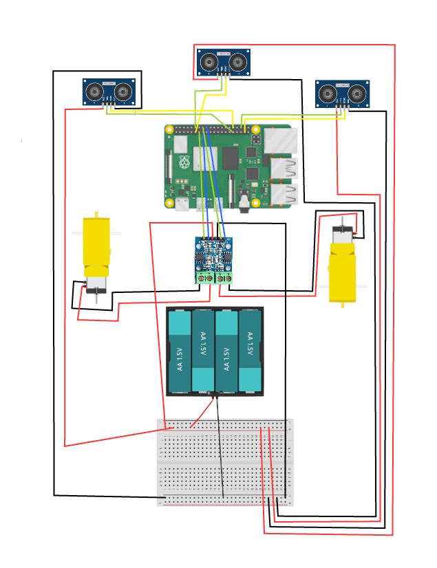

# Ball Tracking Robot
  The ball tracking robot is a robot designed to track a ball through a camera, and follow it using ultrasonic sensors. One of the biggest challenge was getting the ball to be detected through the raspberry pi camera, as it took me a while to figure out how opencv really works. I also had some problems with videoCapture() and videoStream(), so I decided to use PiCamera instead of opencv to do the frame part of the robot. 
<!--Replace this text with a brief description (2-3 sentences) of your project. This description should draw the reader in and make them interested in what you've built. You can include what the biggest challenges, takeaways, and triumphs from completing the project were. As you complete your portfolio, remember your audience is less familiar than you are with all that your project entails!-->

--You should comment out all portions of your portfolio that you have not completed yet, as well as any instructions:
```HTML 
This is an HTML comment in Markdown 
Anything between these symbols will not render on the published site 
```

| **Engineer** | **School** | **Area of Interest** | **Grade** |
|:--:|:--:|:--:|:--:|
| Omeed K. | Saratoga High | Computer Engineering? | Incoming Sophmore


**Replace the BlueStamp logo below with an image of yourself and your completed project. Follow the guide [here](https://tomcam.github.io/least-github-pages/adding-images-github-pages-site.html) if you need help.**-->


  
# Final Milestone

**Don't forget to replace the text below with the embedding for your milestone video. Go to Youtube, click Share -> Embed, and copy and paste the code to replace what's below.**

<iframe width="560" height="315" src="https://www.youtube.com/embed/F7M7imOVGug" title="YouTube video player" frameborder="0" allow="accelerometer; autoplay; clipboard-write; encrypted-media; gyroscope; picture-in-picture; web-share" allowfullscreen></iframe>
  For my final milestone, I was able to get the robot to efficiently track the ball, and follow it if it goes too far aweay. Since milestone 2, I was able to track the ball using openCV and PiCamera, while also being able to turn the robot based on the feedback given from the video stream. Finally, I also made it so the robot would move forward if the distance between the robot and the ball was greater than x amount, and stop if the distance was less than x amount. I still wasn't able to get the battery pack to connect to the raspberry pi without disconnecting all the time, so I just decided to use a rechargeable power bank that was given to me. So far in BSE, my biggest challenges were getting openCV to track the ball, while also making sure it would track a single ball, and not get distracted by everything else in the camera feed. Still, it was definitely rewarding when I solved both of those issues.
  
  The first key topic I learned in BSE was Raspberry Pi. This was the first time I used something like Raspberry Pi, so it was a completely different experience than what I imageined. The second key topic I learned was how a breadboard works, as this was the first time I had played with a breadboard before. Even though it took a lot of google searching, I was able to understand how it worked, and use it moving forward. The third key topic I learned was openCV and GPIO syntax, including all the different functions included with the opencv package. This includes things like GPIO.setup(), cv2.cvtColor(), cv2.videoCapture(), etc. Finally, I learned the math behind using ultrasonic sensors, and how to find the distance only by using ultrasonic waves. In the future, I hope to get much more in-depth into the specific parts of Raspberry Pi, while also learning new things and trying more complex projects. It would also be nice to learn soldering too.
For your final milestone, explain the outcome of your project. Key details to include are:
- What you've accomplished since your previous milestone
- What your biggest challenges and triumphs were at BSE
- A summary of key topics you learned about
- What you hope to learn in the future after everything you've learned at BSE


# Second Milestone

**Don't forget to replace the text below with the embedding for your milestone video. Go to Youtube, click Share -> Embed, and copy and paste the code to replace what's below.**

<iframe width="560" height="315" src="https://www.youtube.com/embed/y3VAmNlER5Y" title="YouTube video player" frameborder="0" allow="accelerometer; autoplay; clipboard-write; encrypted-media; gyroscope; picture-in-picture; web-share" allowfullscreen></iframe>
  For my second milestone, I worked on connecting the ultrasonic sensors, while trying to figure out ways to attach it to the breadboard. I wasn't able to see how I could attach the 2 other ultrasonic sensors shown on the schematic for the project, so I just attached one of them for now. One major challenge that I faced was that my connection from the battery to the VCC and Ground ports in the Raspberry Pi were pretty weak, as it would disconnect and reconnect easily, making it hard to control wirelessly. Hopefully I can fix this problem by Milestone 3, so the bot can be able to run wirelessly with the battery pack. For my final milestone, I need to be able to attach the camera and ultrasonic sensors to a stable position, and be able to code 
For your second milestone, explain what you've worked on since your previous milestone. You can highlight:
- Technical details of what you've accomplished and how they contribute to the final goal
- What has been surprising about the project so far
- Previous challenges you faced that you overcame
- What needs to be completed before your final milestone 

# First Milestone

**Don't forget to replace the text below with the embedding for your milestone video. Go to Youtube, click Share -> Embed, and copy and paste the code to replace what's below.**

<iframe width="560" height="315" src="https://www.youtube.com/embed/CaCazFBhYKs" title="YouTube video player" frameborder="0" allow="accelerometer; autoplay; clipboard-write; encrypted-media; gyroscope; picture-in-picture; web-share" allowfullscreen></iframe>
  My project, the bal tracking robot, is designed to track a ball using ultrasonic sensors (distance sensors), and a built in Raspberry Pi Camera. So far, I've connected the chassis with the motors and wheels, and the battery pack installed. The Raspberry Pi's software is correctly installed, and it connects well with my moniter. I also have the breadboard attached, with all the wires connecting everything together. One major challenege I faced was the limitted amount of space, as I had to switch around the components so everything could fit. So far, the layout seems to fit everything that I need, with the exception of the PiCamera. To complete the project, my plan is to figure out how the ultrasonic sensors work, and also learn how to track the ball using openCV.  


# Schematics 
Here's where you'll put images of your schematics. [Tinkercad](https://www.tinkercad.com/blog/official-guide-to-tinkercad-circuits) and [Fritzing](https://fritzing.org/learning/) are both great resoruces to create professional schematic diagrams, though BSE recommends Tinkercad becuase it can be done easily and for free in the browser. 


# Code
Here's where you'll put your code. The syntax below places it into a block of code. Follow the guide [here]([url](https://www.markdownguide.org/extended-syntax/)) to learn how to customize it to your project needs. 

```py
# import the necessary packages
from picamera.array import PiRGBArray     #As there is a resolution problem in raspberry pi, will not be able to capture frames by VideoCapture
from picamera import PiCamera
import RPi.GPIO as GPIO
import time
import cv2

import numpy as np

#hardware work
GPIO.setmode(GPIO.BOARD)

GPIO_TRIGGER1 = 37      #Left ultrasonic sensor
GPIO_ECHO1 = 36

GPIO_TRIGGER2 = 11      #Front ultrasonic sensor
GPIO_ECHO2 = 12

GPIO_TRIGGER3 = 31      #Right ultrasonic sensor
GPIO_ECHO3 = 32

MOTOR1B=13  #Left Motor
MOTOR1E=15

MOTOR2B=18  #Right Motor
MOTOR2E=16

#LED_PIN=13  #If it finds the ball, then it will light up the led

# Set pins as output and input
GPIO.setup(GPIO_TRIGGER1,GPIO.OUT)  # Trigger
GPIO.setup(GPIO_ECHO1,GPIO.IN)      # Echo
GPIO.setup(GPIO_TRIGGER2,GPIO.OUT)  # Trigger
GPIO.setup(GPIO_ECHO2,GPIO.IN)
GPIO.setup(GPIO_TRIGGER3,GPIO.OUT)  # Trigger
GPIO.setup(GPIO_ECHO3,GPIO.IN)
#GPIO.setup(LED_PIN,GPIO.OUT)

# Set trigger to False (Low)
GPIO.output(GPIO_TRIGGER1, False)
GPIO.output(GPIO_TRIGGER2, False)
GPIO.output(GPIO_TRIGGER3, False)

# Allow module to settle
def sonar(GPIO_TRIGGER,GPIO_ECHO):
      start=0
      stop=0
      # Set pins as output and input
      GPIO.setup(GPIO_TRIGGER,GPIO.OUT)  # Trigger
      GPIO.setup(GPIO_ECHO,GPIO.IN)      # Echo
     
      # Set trigger to False (Low)
      GPIO.output(GPIO_TRIGGER, False)
     
      # Allow module to settle
      time.sleep(0.01)
           
      #while distance > 5:
      #Send 10us pulse to trigger
      GPIO.output(GPIO_TRIGGER, True)
      time.sleep(0.00001)
      GPIO.output(GPIO_TRIGGER, False)
      begin = time.time()
      while GPIO.input(GPIO_ECHO)==0 and time.time()<begin+0.05:
            start = time.time()
     
      while GPIO.input(GPIO_ECHO)==1 and time.time()<begin+0.1:
            stop = time.time()
     
      # Calculate pulse length
      elapsed = stop-start
      # Distance pulse travelled in that time is time
      # multiplied by the speed of sound (cm/s)
      distance = elapsed * 34000
     
      # That was the distance there and back so halve the value
      distance = distance / 2
     
      #print "Distance : %.1f" % distance
      # Reset GPIO settings
      return distance

GPIO.setup(MOTOR1B, GPIO.OUT)
GPIO.setup(MOTOR1E, GPIO.OUT)

GPIO.setup(MOTOR2B, GPIO.OUT)
GPIO.setup(MOTOR2E, GPIO.OUT)

def forward():
      GPIO.output(MOTOR1B, GPIO.HIGH)
      GPIO.output(MOTOR1E, GPIO.LOW)
      GPIO.output(MOTOR2B, GPIO.HIGH)
      GPIO.output(MOTOR2E, GPIO.LOW)
     
def reverse():
      GPIO.output(MOTOR1B, GPIO.LOW)
      GPIO.output(MOTOR1E, GPIO.HIGH)
      GPIO.output(MOTOR2B, GPIO.LOW)
      GPIO.output(MOTOR2E, GPIO.HIGH)
     
def rightturn():
      GPIO.output(MOTOR1B,GPIO.LOW)
      GPIO.output(MOTOR1E,GPIO.HIGH)
      GPIO.output(MOTOR2B,GPIO.HIGH)
      GPIO.output(MOTOR2E,GPIO.LOW)
     
def leftturn():
      GPIO.output(MOTOR1B,GPIO.HIGH)
      GPIO.output(MOTOR1E,GPIO.LOW)
      GPIO.output(MOTOR2B,GPIO.LOW)
      GPIO.output(MOTOR2E,GPIO.HIGH)

def stop():
      GPIO.output(MOTOR1E,GPIO.LOW)
      GPIO.output(MOTOR1B,GPIO.LOW)
      GPIO.output(MOTOR2E,GPIO.LOW)
      GPIO.output(MOTOR2B,GPIO.LOW)
     
#Image analysis work
def segment_colour(frame):    #returns only the red colors in the frame
    hsv_roi =  cv2.cvtColor(frame, cv2.COLOR_BGR2HSV)
    mask_1 = cv2.inRange(hsv_roi, np.array([160, 160,10]), np.array([190,255,255]))
    ycr_roi=cv2.cvtColor(frame,cv2.COLOR_BGR2YCrCb)
    mask_2=cv2.inRange(ycr_roi, np.array((0.,165.,0.)), np.array((255.,255.,255.)))

    mask = mask_1 | mask_2
    kern_dilate = np.ones((8,8),np.uint8)
    kern_erode  = np.ones((3,3),np.uint8)
    mask= cv2.erode(mask,kern_erode)      #Eroding
    mask=cv2.dilate(mask,kern_dilate)     #Dilating
    #cv2.imshow('mask',mask)
    return mask

def find_blob(blob): #returns the red colored circle
    largest_contour=0
    cont_index=0
    contours, hierarchy = cv2.findContours(blob, cv2.RETR_CCOMP, cv2.CHAIN_APPROX_SIMPLE)
    for idx, contour in enumerate(contours):
        area=cv2.contourArea(contour)
        if (area >largest_contour) :
            largest_contour=area
           
            cont_index=idx
            #if res>15 and res<18:
            #    cont_index=idx
                              
    r=(0,0,2,2)
    if len(contours) > 0:
        r = cv2.boundingRect(contours[cont_index])
       
    return r,largest_contour

def target_hist(frame):
    hsv_img=cv2.cvtColor(frame, cv2.COLOR_BGR2HSV)
   
    hist=cv2.calcHist([hsv_img],[0],None,[50],[0,255])
    return hist

#CAMERA CAPTURE
#initialize the camera and grab a reference to the raw camera capture
camera = PiCamera()
camera.resolution = (160, 128)
camera.framerate = 16
rawCapture = PiRGBArray(camera, size=(160, 128))
 
# allow the camera to warmup
time.sleep(0.001)
 
# capture frames from the camera
for image in camera.capture_continuous(rawCapture, format="bgr", use_video_port=True):
      #grab the raw NumPy array representing the image, then initialize the timestamp and occupied/unoccupied text
      frame = image.array
      frame=cv2.flip(frame,1)
      frame = cv2.rotate(frame, cv2.ROTATE_90_CLOCKWISE)
      frame = cv2.rotate(frame, cv2.ROTATE_90_CLOCKWISE)
      global centre_x
      global centre_y
      centre_x=0.
      centre_y=0.
      hsv1 = cv2.cvtColor(frame, cv2.COLOR_BGR2HSV)
      mask_red=segment_colour(frame)      #masking red the frame
      loct,area=find_blob(mask_red)
      x,y,w,h=loct
     
      #distance coming from front ultrasonic sensor
      distanceC = sonar(GPIO_TRIGGER2,GPIO_ECHO2)
      #distance coming from right ultrasonic sensor
      distanceR = sonar(GPIO_TRIGGER3,GPIO_ECHO3)
      #distance coming from left ultrasonic sensor
      distanceL = sonar(GPIO_TRIGGER1,GPIO_ECHO1)
             
      if (w*h) < 10:
            found=0
      else:
            found=1
            simg2 = cv2.rectangle(frame, (x,y), (x+w,y+h), 255,2)
            centre_x=x+((w)/2)
            centre_y=y+((h)/2)
            cv2.circle(frame,(int(centre_x),int(centre_y)),3,(0,110,255),-1)
            centre_x-=80
            centre_y=6--centre_y
            print (centre_x,centre_y)
      initial=300
      flag=0
      #GPIO.output(LED_PIN,GPIO.LOW)          
      if(found==0):
            #if the ball is not found and the last time it sees ball in which direction, it will start to rotate in that direction
            if flag==0:
                  rightturn()
                  time.sleep(0.05)
            else:
                  leftturn()
                  time.sleep(0.05)
            stop()
            time.sleep(0.0125)
     
      elif(found==1):
            if(area<initial):
                  if(distanceC<10):
                        #if ball is too far but it detects something in front of it,then it avoid it and reaches the ball.
                        if distanceR>=8:
                              rightturn()
                              time.sleep(0.00625)
                              stop()
                              time.sleep(0.0125)
                              forward()
                              time.sleep(0.00625)
                              stop()
                              time.sleep(0.0125)
                              #while found==0:
                              leftturn()
                              time.sleep(0.00625)
                        elif distanceL>=8:
                              leftturn()
                              time.sleep(0.00625)
                              stop()
                              time.sleep(0.0125)
                              forward()
                              time.sleep(0.00625)
                              stop()
                              time.sleep(0.0125)
                              rightturn()
                              time.sleep(0.00625)
                              stop()
                              time.sleep(0.0125)
                        else:
                              stop()
                              time.sleep(0.01)
                  else:
                        #otherwise it move forward
                        forward()
                        time.sleep(0.00625)
            elif(area>=initial):
                  initial2=6700
                  if(area<initial2):
                        if(distanceC>10):
                              #it brings coordinates of ball to center of camera's imaginary axis.
                              if(centre_x<=-20 or centre_x>=20):
                                    if(centre_x<0):
                                          flag=0
                                          rightturn()
                                          time.sleep(0.025)
                                    elif(centre_x>0):
                                          flag=1
                                          leftturn()
                                          time.sleep(0.025)
                              forward()
                              time.sleep(0.00003125)
                              stop()
                              time.sleep(0.00625)
                        else:
                              stop()
                              time.sleep(0.01)

                  else:
                        #if it founds the ball and it is too close it lights up the led.
                        #GPIO.output(LED_PIN,GPIO.HIGH)
                        time.sleep(0.1)
                        stop()
                        time.sleep(0.1)
      #cv2.imshow("draw",frame)    
      rawCapture.truncate(0)  # clear the stream in preparation for the next frame
         
      if(cv2.waitKey(1) & 0xff == ord('q')):
            break

GPIO.cleanup() #free all the GPIO pins
```

# Bill of Materials
Here's where you'll list the parts in your project. To add more rows, just copy and paste the example rows below.
Don't forget to place the link of where to buy each component inside the quotation marks in the corresponding row after href =. Follow the guide [here]([url](https://www.markdownguide.org/extended-syntax/)) to learn how to customize this to your project needs. 

| **Part** | **Note** | **Price** | **Link** |
|:--:|:--:|:--:|:--:|
| Drive Train | Chassis, wheels, battery, motors - the battery pack that comes along with it has a low voltage when connected to the raspberry pi, so it would be better to connect the backup battery to the raspberry pi instead of the battery pack| $13.59 | <a href="https://www.amazon.com/Smart-Chassis-Motors-Encoder-Battery/dp/B01LXY7CM3/ref=sr_1_5?crid=373Y5YK6JWMD&keywords=robot+chassis&qid=1687740144&sprefix=robot+chassi%2Caps%2C93&sr=8-5"> Link </a> |
|:--:|:--:|:--:|:--:|
| Raspberry Pi |  | $139.99 | <a href="https://www.amazon.com/CanaKit-Raspberry-4GB-Starter-Kit/dp/B07V5JTMV9/ref=sr_1_2_sspa?crid=S71E3O7XIUUH&keywords=raspberry%2Bpi%2B4&qid=1689364765&sprefix=raspberry%2Bpi%2B4%2Caps%2C184&sr=8-2-spons&sp_csd=d2lkZ2V0TmFtZT1zcF9hdGY&th=1"> Link </a> |
|:--:|:--:|:--:|:--:|
| Screwdriver Kit | The screwdrivers in the kit are extremely tiny, so make sure to keep them somewhere safe | $7.98 | <a href="https://www.amazon.com/Small-Screwdriver-Set-Mini-Magnetic/dp/B08RYXKJW9/"> Link </a> |
|:--:|:--:|:--:|:--:|
| Ultrasonic Sensor | A.K.A. Distance Sensor | $8.99 | <a href="https://www.amazon.com/ELEGOO-HC-SR04-Ultrasonic-Distance-MEGA2560/dp/B01COSN7O6/"> Link </a> |
|:--:|:--:|:--:|:--:|
| H Bridges | only using one of them | $8.99 | <a href="https://www.amazon.com/ACEIRMC-Stepper-Controller-2-5-12V-H-Bridge/dp/B0923VMKSZ/"> Link </a> |
|:--:|:--:|:--:|:--:|
| Raspberry Pi Camera | **IMPORTANT**: It's an Arducam, not a picam... I made the mistake of thinking it was a picam, when in reality it was an arducam (it makes a big difference) | $9.99 | <a href="https://www.amazon.com/Arducam-Megapixels-Sensor-OV5647-Raspberry/dp/B012V1HEP4/"> Link </a> |
|:--:|:--:|:--:|:--:|
| Jumper Wires | Connecting everything together | $6.98 | <a href="https://www.amazon.com/Elegoo-EL-CP-004-Multicolored-Breadboard-arduino/dp/B01EV70C78/"> Link </a> |
|:--:|:--:|:--:|:--:|
| Keyboard and Mouse | To connect to Raspberry Pi (didn't use though) | $23.99 | <a href="https://www.amazon.com/gp/product/B07XDWCLYF/ref=ppx_yo_dt_b_search_asin_title?ie=UTF8&psc=1"> Link </a> |
|:--:|:--:|:--:|:--:|
| Wire Strippers | Cuts wires | $6.98 | <a href="https://www.amazon.com/Eclipse-CP-301G-ProsKit-Precision-Stripper/dp/B005JVJDIA/ref=sr_1_5?crid=3EA8H92LI1T8Z&keywords=30+awg+stripper&qid=1687440357&sprefix=30awg+stripper%2Caps%2C160&sr=8-5"> Link </a> |
|:--:|:--:|:--:|:--:|
| Soldering Kit | Solders stuff | $17.99 | <a href="https://www.amazon.com/Soldering-Iron-Kit-Temperature-Desoldering/dp/B07S61WT16/ref=sxts_b2b_sx_reorder_acb_business?content-id=amzn1.sym.44ecadb3-1930-4ae5-8e7f-c0670e7d86ce%3Aamzn1.sym.44ecadb3-1930-4ae5-8e7f-c0670e7d86ce&crid=3M9M2FJSFSN8U&cv_ct_cx=soldering+kit&keywords=soldering+kit&pd_rd_i=B07S61WT16&pd_rd_r=81dfb3be-2f9f-471b-9612-c467f88a93a0&pd_rd_w=6Cvia&pd_rd_wg=6kA87&pf_rd_p=44ecadb3-1930-4ae5-8e7f-c0670e7d86ce&pf_rd_r=7FY6MS4DKN5ENRJ6J8WD&qid=1685477027&sbo=RZvfv%2F%2FHxDF%2BO5021pAnSA%3D%3D&sprefix=soldering+ki%2Caps%2C163&sr=1-1-62d64017-76a9-4f2a-8002-d7ec97456eea"> Link </a> |
|:--:|:--:|:--:|:--:|
| Digital Multimeter | Measures voltage | $9.98 | <a href="https://www.amazon.com/Etekcity-Multimeter-MSR-R500-Electronic-Multimeters/dp/B01N9QW620/ref=sxts_b2b_sx_reorder_acb_business?content-id=amzn1.sym.44ecadb3-1930-4ae5-8e7f-c0670e7d86ce%3Aamzn1.sym.44ecadb3-1930-4ae5-8e7f-c0670e7d86ce&crid=1741POGJIFZMN&cv_ct_cx=multimeter&keywords=multimeter&pd_rd_i=B01N9QW620&pd_rd_r=831d94e3-2e6d-428c-aeed-e326df3b43f6&pd_rd_w=WPcva&pd_rd_wg=EsDRz&pf_rd_p=44ecadb3-1930-4ae5-8e7f-c0670e7d86ce&pf_rd_r=XZMYRCR5X4ZWN2YPYV9E&qid=1687376939&sprefix=multimeter%2Caps%2C88&sr=1-1-62d64017-76a9-4f2a-8002-d7ec97456eea"> Link </a> |
|:--:|:--:|:--:|:--:|
| Safety Glasses | Wear them while soldering | $6.12 | <a href="https://www.amazon.com/MCR-Safety-CL010-Checklite-Glasses/dp/B009SRXSUA/ref=sr_1_12?keywords=safety+glasses&qid=1687376864&sprefix=safety+gla%2Caps%2C91&sr=8-12"> Link </a> |
|:--:|:--:|:--:|:--:|
| Backup Battery | Extra battery if other one is broken | $16.99 | <a href="https://www.amazon.com/EnergyQC-Portable-Ultra-Compact-Compatible-More-Black/dp/B09Z6T7FQ8/ref=sr_1_31?crid=KNHGHKNN3CWT&keywords=backup+battery+usb&qid=1687378917&sprefix=backup+battery+usb%2Caps%2C86&sr=8-31"> Link </a> |
|:--:|:--:|:--:|:--:|
| Solderless Breadboard | My kit for some reason didn't come with the breadboard (it was shipped later), but supposedly it does come with the kit | $7.49 | <a href="https://www.amazon.com/HiLetgo-Solderless-Breadboard-Circuit-Prototyping/dp/B00LSG5BJK/ref=sr_1_2_sspa?crid=3NX5AETVJX973&keywords=solderless+breadboard&qid=1689400304&sprefix=solderless+breadboa%2Caps%2C165&sr=8-2-spons&sp_csd=d2lkZ2V0TmFtZT1zcF9hdGY&psc=1"> Link </a> |
|:--:|:--:|:--:|:--:|
| PCB Jumper Wire Kit | this one was shipped with the breadboard, so it didn't come with the package (although it was useful) | $9.99 | <a href="https://www.amazon.com/Sunxeke-Breadboard-Assortment-Different-breadboard/dp/B09NCYJV64/ref=sr_1_1?crid=CUQPQZT53UI5&keywords=sunxeke&qid=1689400502&sprefix=sunxek%2Caps%2C161&sr=8-1&th=1"> Link </a> | 


